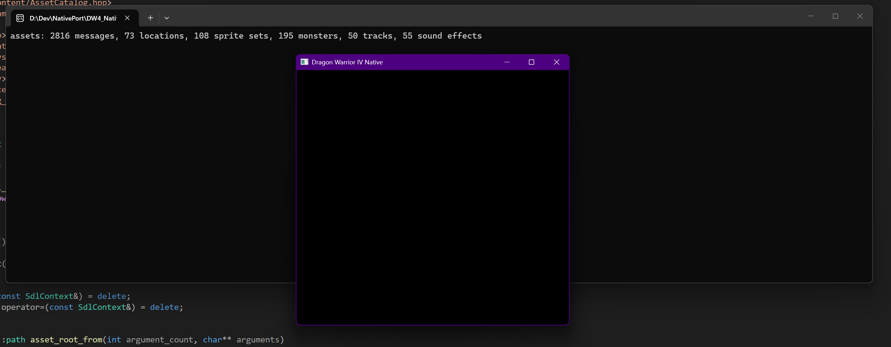

# Development Diary Notes - 20290929

Ok, so this project is ready to start after completing the disassembly.  
First things first, I need a built rom from the disassembly. The disassembly project includes a build.cmd script that I used to compile the rom.  
It requires Visual Studio 2026 with the C++ development workload installed.
The build script is at:  
reference\build.cmd

This generates the built ROM at:
reference\build\Release\Dragon Warrior IV (USA).nes

From there I need to extract the assets from the built ROM and ensure that they are properly organized and ignored by Git according to the project's copyright boundary rules.

I take note of the built ROM's filepath and then I run the asset extraction script at:
reference\tools\AssetExtract\extract_assets.py

The full extraction command looks like this when ran from the project's root directory:
python .\reference\tools\AssetExtract\extract_assets.py --rom "D:\Dev\NativePort\DW4_NativePort\reference\build\Release\Dragon Warrior IV (USA).nes" --out "native\assets\generated"

Now, when opening the project in Visual Studio 2026 we have the following projects:
DW4.Content - Asset loading, validation, and conversion into typed C++ data. The actual extracted payloads live in generated, not inside the project binary.
DW4.Desktop - SDL3 platform layer: rendering, audio output, keyboard/controllers, timing, windows, and filesystem access. It replaces hardware-facing responsibilities without emulating the NES hardware.
DW4.Game - Deterministic gameplay rules and state: movement, battles, dialogue, events, inventory, RNG, and save semantics. It is a static library used by DW4.Desktop.
DW4.Tests -  Unit, integration, replay, and reference-parity tests.

We need to first set DW4.Desktop as the startup project in Visual Studio 2026.
The reason for this is because DW4.Game is a static library.

On first run I got the following error in the terminal:

```ps1
error: required asset catalog is missing: D:\Dev\NativePort\DW4_NativePort\native\desktop\native\assets\generated\text\dialogue.json

D:\Dev\NativePort\DW4_NativePort\build\Debug\DW4.Desktop.exe (process 25300) exited with code 1 (0x1).
To automatically close the console when debugging stops, enable Tools->Options->Debugging->Automatically close the console when debugging stops.
Press any key to close this window . . .
```

To fix this I had to right click DW4.Desktop in the Solution Explorer, select "Properties", and then:
Select Debug | x64.
Open Configuration Properties → Debugging.
Set Working Directory to:

```ps1
$(SolutionDir)
```

After doing that, then rebuilding the project, I was able to get the following screens:

