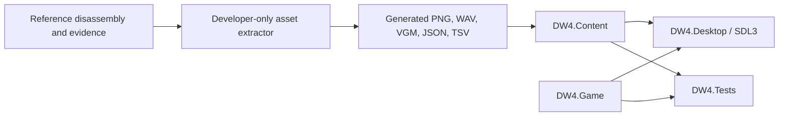

# Native Port Architecture

## Product Boundary

The shipped program is a native reimplementation, not a 6502 emulator and not an assembly wrapper. Native projects
may not include assembly inputs, reference projects, the rebuilt ROM, or an interpreter that executes original game
code. [`check-native-boundary.ps1`](../../scripts/port/check-native-boundary.ps1) enforces the project dependency and
input portions of this rule on every build.

The asset preparation command is intentionally outside the product boundary. It may build the exact reference ROM
and run the existing headless analysis tools because its output is data consumed by the native program. Neither the
ROM nor those tools are runtime dependencies.

There is deliberately no dependency edge from a native target to `reference/`.

## Projects

### `DW4.Game`

Owns deterministic game state and rules. It has no SDL, filesystem, rendering, audio, or reference-tool dependency.
The simulation advances through explicit input frames at the NES NTSC frame cadence. Field, battle, menus, dialogue,
events, and saves will be added here as complete vertical slices.

### `DW4.Content`

Owns typed access to generated data. `AssetCatalog` checks each required top-level extractor catalog before startup and
exposes selected collection counts without leaking JSON types into gameplay. Future loaders should validate complete
schemas and convert extractor documents into immutable domain records at this boundary.

### `DW4.Desktop`

Owns SDL3 startup, keyboard/controller input, timing, rendering, audio output, and operating-system integration. It
depends on `DW4.Game` and `DW4.Content`; neither library depends on it. The logical presentation size is 256 by 240,
with integer scaling handled by SDL3.

### `DW4.Tests`

Owns unit and integration tests now, and deterministic replay plus native-versus-reference parity tests as behavior is
ported. Tests may consume tracked reference evidence files as fixtures, but production projects may not.

## Asset Flow

`extract-native-assets.cmd` performs an exact reference build before invoking the existing exporter. Generated assets
are ignored because they are copyrighted payloads. Only schemas, authored tooling, evidence, and validation code are
tracked. The extractor refuses visible in-repository output paths, and `check-copyright-boundary.ps1` rejects exposed
or force-added ROM/media files and known extracted catalogs during every native build. A normal native build never
invokes the assembler or requires a ROM.

## Source Organization

Native code is organized by gameplay domain rather than PRG bank. Banks, addresses, labels, routine contracts, and
runtime traces remain citations for behavior. They do not dictate native object ownership or recreate a global NES RAM
map. Implementations live under `src/`; public headers live under `include/` when a project exposes them. Visual Studio
filter files mirror that layout in Solution Explorer. Cross-reference decisions are recorded in `routine-map.tsv`.
